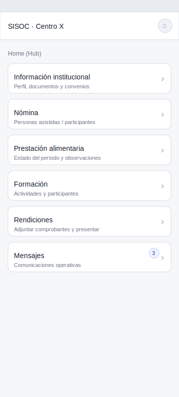
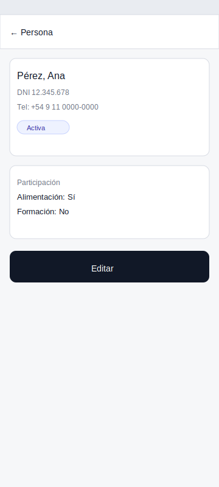

# Pantallas MVP — Definición funcional + mockups (low-fi)

!!! info "Estado"
    **Versión:** v0.2  
    **Última actualización:** 2026-02-03  
    **Responsable:** UI_UX / DOCS_Scribe  
    **Nivel:** Interno

## Convenciones
- Todas las pantallas deben mostrar el **nombre del espacio** (si el usuario opera un espacio).
- “CTA” = acción principal.
- Los permisos se validan server-side (RBAC).

---

# 1) Acceso

## 1.1 Login / Acceso (si aplica)
**Objetivo:** autenticar al usuario.

**Muestra**
- Usuario / contraseña (o mecanismo definido)
- Mensaje de error claro

**CTA**
- Ingresar

**Errores**
- 401: credenciales inválidas
- problemas de red: “No pudimos conectarnos. Reintentá.”

**Depende**
- Definir auth real con SISOC

---

## 1.2 Selector de espacio (solo si multi-espacio)
**Objetivo:** elegir espacio a operar.

**Muestra**
- Lista de espacios habilitados
- Último seleccionado (si aplica)

**CTA**
- Seleccionar espacio → Home

**Estados**
- Sin espacios: “No tenés espacios asignados. Contactá al programa.”

---

# 2) Home (Hub)

## 2.1 Home
**Objetivo:** acceso rápido a módulos del MVP.

**Muestra**
- Tarjetas/atajos:
  - Información institucional
  - Nómina
  - Prestación alimentaria
  - Formación
  - Rendiciones
  - Mensajes

**CTA**
- Entrar a cada módulo

**Estados**
- Badges opcionales:
  - mensajes sin leer
  - rendición observada

**Mockup**

---

# 3) Información institucional

## 3.1 Perfil del espacio
**Objetivo:** ver ficha institucional y contacto.

**Muestra**
- Nombre
- Dirección / localidad
- Provincia / municipio
- Estado (activo/suspendido/etc.)
- Contactos disponibles (WhatsApp, mail, etc.)

**CTA**
- Ver documentos
- Ver mensajes

**Errores**
- 404: espacio no encontrado (problema de asignación)
- Sin datos: mostrar “sin datos” amigable

**Mockup**

---

## 3.2 Documentos (lista)
**Objetivo:** ver documentos y convenios.

**Muestra**
- Lista con:
  - título
  - fecha actualización
  - acción “ver/descargar”

**CTA**
- Abrir documento

**Estados**
- Vacío: “No hay documentos disponibles”

**Mockup**

---

## 3.3 Documento (detalle / descarga)
**Objetivo:** abrir el documento.

**Muestra**
- Título
- Fecha
- Visualizador (si se puede) o descarga

**CTA**
- Descargar / compartir (opcional)

**Mockup**

---

# 4) Mensajes operativos

## 4.1 Mensajes (lista)
**Objetivo:** ver comunicaciones operativas.

**Muestra**
- Lista con:
  - título
  - fecha
  - resumen

**CTA**
- Abrir mensaje

**Estados**
- Vacío: “No hay mensajes por ahora”

**Mockup**

---

## 4.2 Mensaje (detalle)
**Objetivo:** leer el mensaje completo.

**Muestra**
- título
- fecha
- cuerpo completo

**CTA**
- Volver

**Mockup**

---

# 5) Nómina

## 5.1 Nómina (lista + búsqueda)
**Objetivo:** administrar personas asociadas al espacio.

**Muestra**
- Lista de personas:
  - nombre y apellido
  - estado (activa/inactiva)
  - flags (alimentación/formación) si se usan
- Búsqueda
- Filtros (mínimos):
  - activas/inactivas
  - participa alimentación / formación (si aplica)

**CTA**
- Ver detalle
- Alta rápida
- Importar CSV (si el MVP lo permite)

**Estados**
- Vacío: “Todavía no cargaste personas”

**Mockup**

---

## 5.2 Persona (detalle)
**Objetivo:** ver datos de una persona.

**Muestra**
- Nombre y apellido
- Documento (si existe)
- Teléfono (si existe)
- Flags (alimentación/formación)
- Estado activa/inactiva

**CTA**
- Editar
- Activar/Desactivar (según permiso)

**Confirmaciones**
- “¿Querés dar de baja a esta persona?” / “¿Reactivar?”

**Mockup**

---

## 5.3 Persona (alta rápida)
**Objetivo:** cargar una persona con mínimos.

**Muestra**
- Nombre (obligatorio)
- Apellido (obligatorio)
- Documento (opcional)
- Teléfono (opcional)
- Flags (opcional)
- Guardar

**CTA**
- Crear

**Errores**
- 400 validación: “Nombre y apellido son obligatorios”

---

## 5.4 Persona (editar)
**Objetivo:** editar datos.

**Muestra**
- Campos editables (según definición)
- Guardar

**CTA**
- Guardar cambios

---

## 5.5 Importación CSV (si aplica)
**Objetivo:** cargar nómina masiva.

**Muestra**
- Subir archivo
- Resultado:
  - creados / actualizados
  - errores por fila
  - warnings de duplicado

**CTA**
- Importar

**Estados**
- Si no aplica en móvil: “Esta acción se realiza desde la web (SISOC).”

---

# 6) Prestación alimentaria (solo lectura)

## 6.1 Prestación (estado actual)
**Objetivo:** ver estado y mensajes asociados.

**Muestra**
- Estado (vigente / observada / suspendida / etc.)
- Período
- Resumen operativo
- Observaciones (si aplica)

**CTA**
- Ver historial

**Estados**
- Sin datos: “No hay información disponible para este período”

---

## 6.2 Historial por período
**Objetivo:** ver períodos anteriores.

**Muestra**
- Lista de períodos + estado

**CTA**
- Ver detalle de período

---

# 7) Formación

## 7.1 Formación (lista)
**Objetivo:** listar actividades.

**Muestra**
- Lista: título, fecha, estado, cantidad participantes

**CTA**
- Crear actividad
- Ver/editar actividad

**Estados**
- Vacío: “No hay actividades cargadas”

---

# 8) Rendiciones

## 8.1 Rendiciones (lista)
**Objetivo:** ver rendiciones por período.

**Muestra**
- Período
- Estado
- Última actualización
- Observaciones si estado = observada

**CTA**
- Ver detalle
- Crear nueva (si se habilita en MVP)

**Estados**
- Vacío: “No hay rendiciones cargadas”

**Mockup**

---

## 8.2 Rendición (detalle)
**Objetivo:** ver adjuntos y estado.

**Muestra**
- Período
- Estado
- Observaciones (si aplica)
- Lista de adjuntos:
  - nombre archivo
  - estado (cargado/validado/invalidado)
  - motivo si invalidado

**CTA**
- Adjuntar comprobante
- Presentar (si rol referente + condición adjuntos)

**Mockup**

---

## Pendientes para reunión (para cerrar UI)
- ¿El “referente del espacio” existe hoy como usuario SISOC?
- ¿La importación CSV se hace desde móvil o solo web?
- ¿Los documentos y comprobantes se visualizan dentro de app o solo descarga?
- ¿Qué información de prestación alimentaria se puede exponer al espacio?
