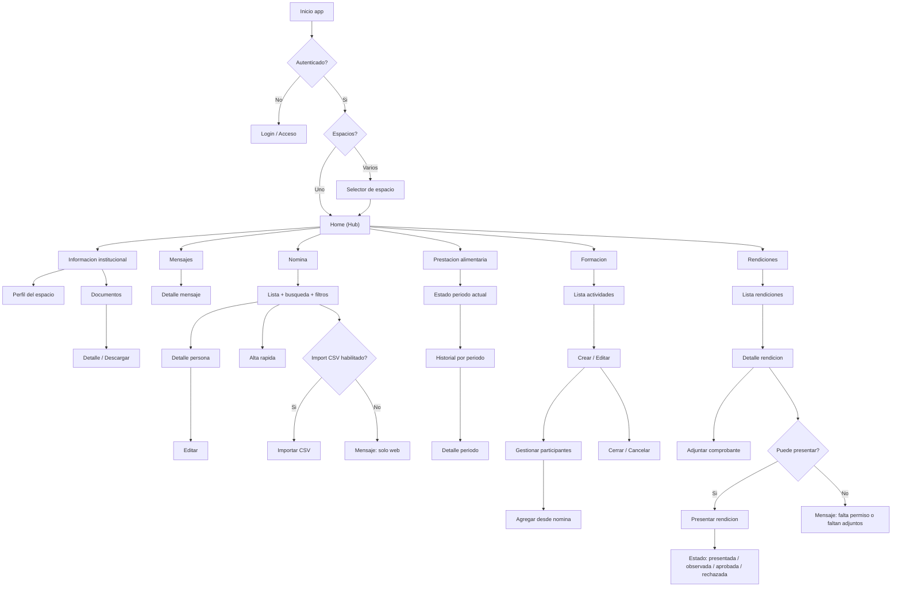

# Wireflow MVP (end-to-end)

!!! info "Estado"
    **Versión:** v0.1  
    **Última actualización:** 2026-02-03  
    **Responsable:** UI_UX  
    **Nivel:** Interno

## Flujo general (navegación)

